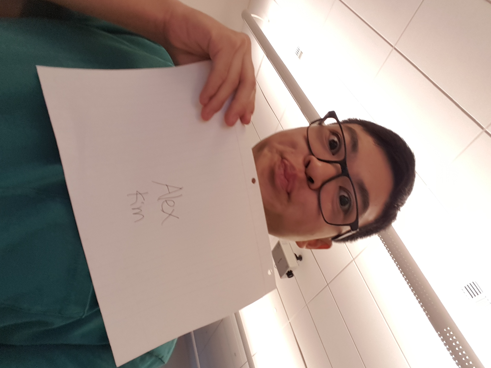

# practice-alex-k

My name is Alex Kim, and I'm from southern Orange County. During my time at SPIS, I hope to learn how to code and write programs as well as gain an exposure to various branches of computer science (such as data science and machine learning) to gauge my interests. My interests include Star Wars, videogames, and card games.

